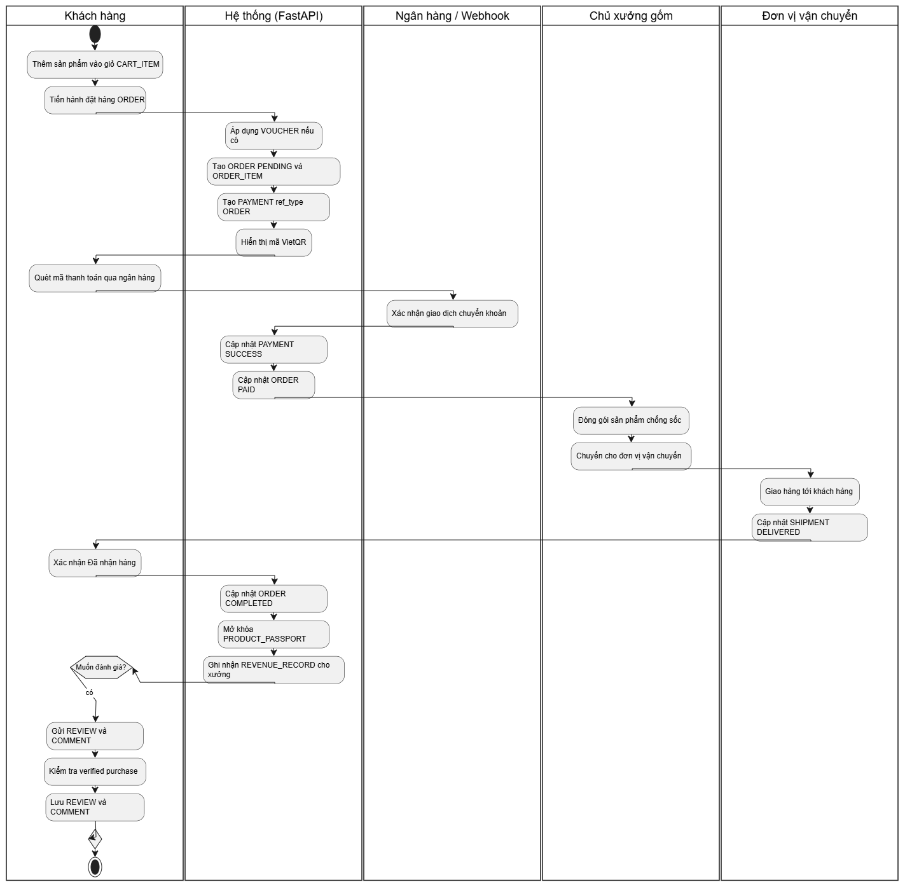
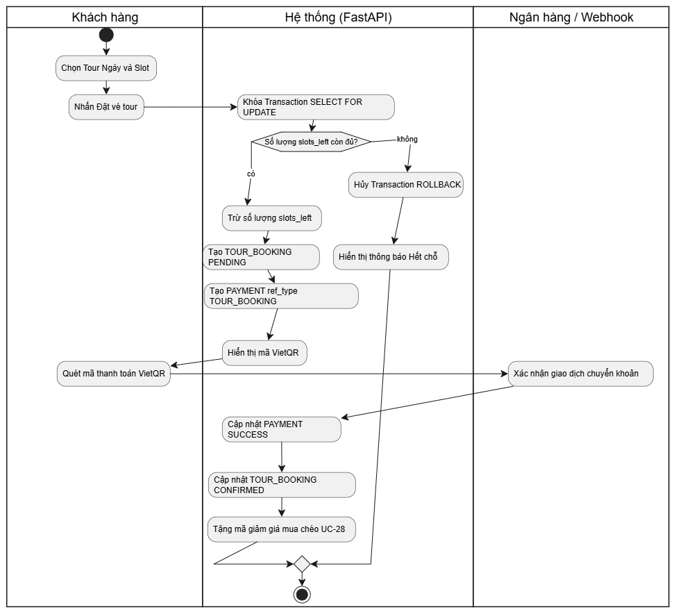

# Nền tảng TMDT Gốm sứ Bát Tràng

Nền tảng thương mại điện tử trung gian kết nối các xưởng gốm tại Bát Tràng với khách hàng B2C/B2B, tích hợp mô hình O2O (đặt tour trải nghiệm làm gốm) và cơ chế "Hộ chiếu sản phẩm" (Product Passport) qua mã QR giúp định vị thương hiệu, tách biệt khỏi cạnh tranh giá rẻ.

## Mục lục

- [Tổng quan nghiệp vụ](#tổng-quan-nghiệp-vụ)
- [Actor hệ thống](#actor-hệ-thống)
- [Chức năng yêu cầu của đồ án](#chức-năng-yêu-cầu-của-đồ-án)
- [Danh sách Use Case](#danh-sách-use-case)
- [Tech stack](#tech-stack)
- [Kiến trúc hệ thống](#kiến-trúc-hệ-thống)
- [Cấu trúc thư mục](#cấu-trúc-thư-mục)
- [Sơ đồ dữ liệu (ERD)](#sơ-đồ-dữ-liệu-erd)
- [Cài đặt & chạy dự án](#cài-đặt--chạy-dự-án)
- [Biến môi trường](#biến-môi-trường)
- [Ghi chú kỹ thuật quan trọng](#ghi-chú-kỹ-thuật-quan-trọng)
- [Trạng thái triển khai](#trạng-thái-triển-khai)
- [Hướng dẫn cho thành viên nhóm](#hướng-dẫn-cho-thành-viên-nhóm)
- [License](#license)

## Tổng quan nghiệp vụ

Nền tảng giải quyết 3 bài toán chính của ngành gốm sứ truyền thống:

1. **Thương mại hóa câu chuyện văn hóa** — mỗi sản phẩm đi kèm mã QR "Hộ chiếu sản phẩm", chỉ mở khóa video nghệ nhân kể chuyện *sau khi* khách mua hàng, tạo trải nghiệm "đập hộp" độc quyền.
2. **Giải quyết rào cản niềm tin khi mua hàng dễ vỡ online** — chính sách "Vỡ 1 đền 1": khách chỉ cần gửi ảnh/video bằng chứng, được hoàn tiền 100% hoặc gửi hàng thay thế ngay, không cần giải trình phức tạp.
3. **Chuyển đổi mua sắm thành du lịch trải nghiệm (O2O)** — khách đặt tour "Một ngày làm nghệ nhân" tại xưởng, sau tour tự động nhận mã giảm giá để mua chéo sản phẩm lưu niệm.

## Actor hệ thống

| Actor | Vai trò |
|---|---|
| Khách hàng (Customer) | Tìm kiếm, mua hàng, quét QR, đặt tour, đánh giá, khiếu nại |
| Chủ xưởng gốm (Workshop Owner) | Đăng sản phẩm, quản lý đơn hàng, quản lý lịch tour |
| Quản trị viên (Admin) | Duyệt đối tác, kiểm duyệt nội dung, phân xử khiếu nại, xử lý feedback, đối soát |
| Đơn vị vận chuyển | Cập nhật trạng thái giao hàng (hệ thống ngoài) |
| Ngân hàng / Webhook | Xác nhận giao dịch VietQR (hệ thống ngoài) |

## Chức năng yêu cầu của đồ án

Bảng ánh xạ các chức năng bắt buộc tới nơi triển khai trong hệ thống:

| Yêu cầu | Triển khai | Use Case / Module |
|---|---|---|
| Lọc, tìm kiếm | Tìm kiếm theo chủ đề văn hóa, lọc theo xưởng / khoảng giá / chất liệu | UC-05, `api/v1/marketplace.py` |
| Sắp xếp | Sắp xếp theo giá, mới nhất, bán chạy | UC-05, `api/v1/marketplace.py` |
| Đăng nhập, đăng xuất | Supabase Auth, FastAPI verify `SUPABASE_JWT_SECRET` | UC-01, 02, `api/v1/auth.py` |
| Giỏ hàng, thanh toán | Giỏ hàng lưu DB theo user; đặt đơn từ giỏ; thanh toán VietQR | UC-15, 39, `api/v1/cart.py`, `orders.py`, `payments.py` |
| Ảnh sản phẩm | Nhiều ảnh/sp lưu Supabase Storage (public URL) | UC-11, Storage |
| Responsive | Tailwind CSS mobile-first cho cả 3 app React | Toàn bộ frontend |
| Liên hệ, feedback | Form liên hệ lưu `CONTACT_MESSAGE`, Admin xem & xử lý | UC-41, `api/v1/feedback.py` |
| Khuyến mại, giá mới/giá cũ | `PRODUCT.original_price` (giá cũ) + `sale_price` (giá mới), voucher giảm giá | UC-06, 27, 28 |
| Đổi trả, bảo hành, vận chuyển | Trang chính sách tĩnh + quy trình "Vỡ 1 đền 1" qua `DISPUTE` | UC-29 → 32, `api/v1/disputes.py` |
| Google Maps | Nhúng bản đồ vị trí xưởng ở gian hàng & trang tour | UC-09, 23, iframe Google Maps |
| Đánh giá sản phẩm, bình luận | `REVIEW` (sao 1–5, chỉ khi đã mua) + `COMMENT` công khai | UC-40, `api/v1/reviews.py` |
| Trang quản trị | Khu vực `/admin` trong app React | UC-33 → 38, `frontend/src/pages/AdminDashboard.jsx` |

## Danh sách Use Case

| Nhóm | Use Case |
|---|---|
| **Authentication & Profile** | UC-01 Đăng ký · UC-02 Đăng nhập / đăng xuất · UC-03 Hồ sơ cá nhân/doanh nghiệp · UC-04 Quản lý thanh toán/ví đối soát |
| **Marketplace** | UC-05 Tìm kiếm, lọc, sắp xếp theo chủ đề văn hóa · UC-06 Xem chi tiết kỹ thuật nung/men (giá cũ – giá mới) · UC-07 Quét QR Hộ chiếu · UC-08 Xem video độc quyền · UC-09 Xem gian hàng xưởng (kèm Google Maps) · UC-39 Quản lý giỏ hàng |
| **Workshop** | UC-10 Quản lý gian hàng · UC-11 Đăng sản phẩm & ảnh/video · UC-12 Sửa nội dung sau từ chối · UC-13 Cập nhật chuẩn bị đơn hàng · UC-14 Báo cáo doanh thu |
| **Order & Logistics** | UC-15 Mua & thanh toán (VietQR) · UC-16 Đóng gói chống sốc · UC-17 Cập nhật giao hàng · UC-18 Xác nhận nhận hàng · UC-19 Báo cáo boom hàng · UC-20 Tiếp nhận hàng hoàn · UC-21 Đối soát & chuyển tiền |
| **O2O Tour** | UC-22 Thiết lập lịch trống · UC-23 Đặt vé tour (xem bản đồ) · UC-24 Thanh toán & trừ slot · UC-25 Hủy lịch tour · UC-26 Cập nhật đã tham gia · UC-27 Nhận mã giảm giá · UC-28 Mua chéo sản phẩm |
| **Dispute & Support** | UC-29 Yêu cầu đền bù · UC-30 Hoàn tiền 100% · UC-31 Gửi sản phẩm thay thế · UC-32 Ghi lịch sử xấu |
| **Đánh giá & Hỗ trợ** | UC-40 Đánh giá sao & bình luận sản phẩm · UC-41 Liên hệ & phản hồi |
| **Admin** | UC-33 Duyệt xưởng gốm · UC-34 Kiểm duyệt nội dung · UC-35 Sinh mã QR tự động · UC-36 Phân xử khiếu nại · UC-37 Quản lý lịch tour ngoại khóa · UC-38 Thống kê doanh thu toàn sàn |

## Tech stack

### Backend

| Thành phần | Công nghệ |
|---|---|
| Framework | FastAPI (Python 3.11+) |
| ORM | SQLAlchemy 2.0 (async) |
| Migration | Alembic |
| Validation | Pydantic v2 |
| Database | Supabase Postgres |
| Auth | Supabase Auth (FastAPI verify JWT bằng `SUPABASE_JWT_SECRET`) |
| File/Media | Supabase Storage |
| Cache/Lock | Postgres advisory lock (hoặc Redis nếu cần) |
| Background job | FastAPI `BackgroundTasks` / Celery (nếu cần job định kỳ) |
| QR code | thư viện `qrcode` (Hộ chiếu sản phẩm) |
| Gọi API ngoài | `httpx` (async) |

### Frontend

| Thành phần | Công nghệ |
|---|---|
| Framework | React (Vite) |
| Data fetching | TanStack Query |
| State | Zustand |
| UI | Tailwind CSS + shadcn/ui (responsive mobile-first) |
| Bản đồ | Google Maps iframe embed |
| Realtime (optional) | `@supabase/supabase-js` client |
| Ứng dụng | 1 project duy nhất (`frontend/`), phân khu theo route: `/` khách hàng · `/workshop` chủ xưởng · `/admin` quản trị |

### Hạ tầng & Thanh toán

| Thành phần | Công nghệ |
|---|---|
| Thanh toán | **VietQR** — sinh mã QR chuyển khoản ngân hàng kèm số tiền & nội dung đơn; xác nhận qua webhook ngân hàng (Casso/SeedTech) hoặc Admin duyệt thủ công |
| Thanh toán mở rộng (tùy chọn) | VNPay sandbox |
| Vận chuyển | Mock webhook GHTK/J&T |
| Containerize | Docker + docker-compose |
| API docs | Swagger UI (tự sinh từ FastAPI `/docs`) |

## Kiến trúc hệ thống

Modular monolith — 1 backend FastAPI duy nhất, chia module theo domain nghiệp vụ, kết nối vào Supabase (Postgres + Auth + Storage). Business logic (state machine đơn hàng, xử lý khiếu nại, đối soát doanh thu, khóa slot tour) nằm hoàn toàn trong service layer của FastAPI — Supabase chỉ đóng vai trò hạ tầng (DB/Auth/Storage), không chứa logic nghiệp vụ.

```
┌──────────────────────────────────┐
│  React SPA (frontend/)           │
│  / khách · /workshop xưởng       │
│  /admin quản trị                 │
└───────────────┬──────────────────┘
                │  REST API (JWT)
        ┌───────┴────────┐
        │   FastAPI      │
        │  (business     │
        │   logic layer) │
        └───────┬────────┘
                │
┌───────────────┼─────────────────┐
│               │                 │
┌───────┴──────┐  ┌──────┴─────────┐  ┌─────┴───────┐
│  Supabase    │  │  Supabase Auth │  │  Supabase   │
│  Postgres    │  │  (JWT issuer)  │  │  Storage    │
└──────────────┘  └────────────────┘  └─────────────┘
```

## Cấu trúc thư mục

```
TMDT/
├── backend/
│   ├── app/
│   │   ├── main.py
│   │   ├── core/
│   │   │   ├── config.py           # settings (env)
│   │   │   ├── security.py         # verify JWT Supabase
│   │   │   └── database.py         # session, engine (Supabase Postgres)
│   │   ├── models/                  # SQLAlchemy models
│   │   │   ├── user.py
│   │   │   ├── workshop.py
│   │   │   ├── product.py
│   │   │   ├── product_passport.py
│   │   │   ├── cart_item.py
│   │   │   ├── order.py
│   │   │   ├── review.py           # REVIEW + COMMENT
│   │   │   ├── tour.py
│   │   │   ├── dispute.py
│   │   │   ├── payment.py
│   │   │   └── feedback.py
│   │   ├── schemas/                 # Pydantic DTOs
│   │   ├── api/
│   │   │   └── v1/
│   │   │       ├── auth.py          # UC-01, 02 (đăng nhập / đăng xuất)
│   │   │       ├── users.py         # UC-03, 04
│   │   │       ├── marketplace.py   # UC-05 (lọc/tìm/sắp xếp), 06, 09
│   │   │       ├── cart.py          # UC-39 giỏ hàng
│   │   │       ├── product_passport.py # UC-07, 08, 35
│   │   │       ├── workshop.py      # UC-10, 11, 12, 13, 14
│   │   │       ├── orders.py        # UC-15, 16, 18
│   │   │       ├── shipping.py      # UC-17, 19, 20
│   │   │       ├── payments.py      # UC-21, 30 (VietQR + webhook)
│   │   │       ├── tours.py         # UC-22, 23, 24, 25, 26
│   │   │       ├── promotions.py    # UC-27, 28
│   │   │       ├── reviews.py       # UC-40 đánh giá & bình luận
│   │   │       ├── disputes.py      # UC-29, 31, 32, 36
│   │   │       ├── feedback.py      # UC-41 liên hệ & phản hồi
│   │   │       └── admin.py         # UC-33, 34, 37, 38
│   │   ├── services/                # business logic
│   │   │   ├── order_service.py
│   │   │   ├── tour_service.py
│   │   │   ├── payment_service.py
│   │   │   └── dispute_service.py
│   │   ├── enums/
│   │   │   ├── order_status.py      # state machine đơn hàng
│   │   │   └── tour_status.py
│   │   └── tasks/                   # background jobs
│   ├── alembic/                     # migrations
│   ├── tests/
│   ├── requirements.txt
│   ├── .env.example
│   └── Dockerfile
│
├── frontend/                          # React (Vite) — port 5173
│   ├── src/
│   │   ├── components/               # Layout, ProtectedRoute...
│   │   ├── lib/
│   │   │   ├── api.js                # fetch helper + API_BASE_URL
│   │   │   └── supabase.js           # Supabase client
│   │   └── pages/
│   │       ├── CustomerHome.jsx      # route /
│   │       ├── WorkshopDashboard.jsx # route /workshop
│   │       └── AdminDashboard.jsx    # route /admin
│   ├── .env.example
│   └── Dockerfile
│
├── docs/
│   └── erd.png                      # sơ đồ ERD export từ công cụ thiết kế
├── docker-compose.yml
└── README.md
```

## Sơ đồ dữ liệu (ERD)


Các bảng chính: `USER`, `WORKSHOP`, `PRODUCT`, `PRODUCT_PASSPORT`, `CART_ITEM`, `ORDER`, `ORDER_ITEM`, `PAYMENT`, `SHIPMENT`, `DISPUTE`, `REVIEW`, `COMMENT`, `TOUR_SLOT`, `TOUR_BOOKING`, `VOUCHER`, `REVENUE_RECORD`, `CONTACT_MESSAGE`.

Điểm thiết kế đáng chú ý:

- `PRODUCT` có `original_price` (giá cũ) và `sale_price` (giá mới) — hiển thị giá gạch ngang khi đang khuyến mại.
- `PAYMENT` dùng khóa đa hình (`ref_type` + `ref_id`) vì cả `ORDER` và `TOUR_BOOKING` đều phát sinh thanh toán/hoàn tiền.
- `PRODUCT_PASSPORT` tách khỏi `PRODUCT`, có cờ `unlocked` — chỉ mở sau khi đơn hàng hoàn tất.
- `CART_ITEM` ràng buộc unique `(user_id, product_id)` — tăng/giảm số lượng thay vì tạo dòng trùng.
- `REVIEW` kiểm tra "verified purchase" (user có đơn hoàn tất chứa sản phẩm) trước khi cho phép chấm sao.
- `DISPUTE` liên kết `order_id` và `customer_id`, có trường `resolution` (refund/replace).
- `TOUR_SLOT` tách khỏi `TOUR_BOOKING` để quản lý `slots_left` độc lập — cần khóa transaction khi nhiều khách đặt cùng lúc.
- `REVENUE_RECORD` lưu theo `period` phục vụ đối soát và thống kê toàn sàn mà không cần tính lại từ `ORDER`.
- `CONTACT_MESSAGE` lưu form liên hệ/feedback, Admin đánh dấu trạng thái xử lý.
## 4. Sơ đồ Luồng Hoạt động (Activity Diagrams)

### 4.1. E-Commerce & Payment Flow

### 4.2. Tour-booking-flow

## Cài đặt & chạy dự án

### Yêu cầu

- Python 3.11+
- Node.js 18+
- Tài khoản Supabase (project đã tạo, lấy được `SUPABASE_URL`, `SUPABASE_ANON_KEY`, `SUPABASE_SERVICE_ROLE_KEY`, connection string Postgres)
- Tài khoản ngân hàng để nhận VietQR (BIN ngân hàng + số tài khoản)
- Docker (khuyến nghị, để chạy đồng bộ)

### Bảng port dịch vụ

| Dịch vụ | Port mặc định |
|---|---|
| Backend FastAPI | 8000 |
| frontend | 5173 |

### Backend

```bash
cd backend
python -m venv venv
source venv/bin/activate      # Windows: venv\Scripts\activate
pip install -r requirements.txt

cp .env.example .env          # điền thông tin Supabase + VietQR vào .env

alembic upgrade head           # chạy migration lên Supabase Postgres
uvicorn app.main:app --reload --port 8000
```

Swagger UI: `http://localhost:8000/docs`

### Chạy test

```bash
cd backend
pytest
```

### Frontend

```bash
cd frontend
npm install
cp .env.example .env          # điền SUPABASE_URL, SUPABASE_ANON_KEY, API_BASE_URL
npm run dev                   # port 5173
```

Các khu vực truy cập qua route: `/` (khách hàng) · `/workshop` (chủ xưởng) · `/admin` (quản trị). Việc phân quyền thật được backend kiểm tra qua JWT; frontend chỉ ẩn/hiện menu theo vai trò.

### Chạy bằng Docker (tùy chọn)

```bash
docker-compose up --build
```

## Biến môi trường

### `backend/.env`

```
# Supabase
SUPABASE_URL=
SUPABASE_ANON_KEY=
SUPABASE_SERVICE_ROLE_KEY=
DATABASE_URL=postgresql+asyncpg://...     # connection string Supabase Postgres
SUPABASE_JWKS_URL=                         # xác minh JWT qua JWKS (project Supabase mới)
SUPABASE_JWT_SECRET=                       # chỉ dùng cho project Supabse cũ (legacy HS256)

# VietQR (thanh toán chuyển khoản)
VIETQR_CLIENT_ID=                          # từ vietqr.io (nếu dùng API chính thức)
VIETQR_API_KEY=
BANK_BIN=970436                            # BIN ngân hàng thụ hưởng, ví dụ Vietcombank
ACCOUNT_NO=
ACCOUNT_NAME=

# Webhook đối soát giao dịch (tùy chọn — Casso/SeedTech)
CASSO_API_KEY=
CASSO_WEBHOOK_SECRET=

# VNPay sandbox (tùy chọn — cổng thanh toán mở rộng)
VNPAY_TMN_CODE=
VNPAY_HASH_SECRET=
```

### `frontend/.env`

```
VITE_SUPABASE_URL=
VITE_SUPABASE_ANON_KEY=
VITE_API_BASE_URL=http://localhost:8000
```

## Ghi chú kỹ thuật quan trọng

- **State machine đơn hàng**: trạng thái đơn hàng (`pending_payment → preparing → shipping → completed / disputing / returned`) được định nghĩa tập trung trong `enums/order_status.py` và validate transition trong `order_service.py` — tránh cập nhật trạng thái tùy tiện từ nhiều route.
- **Race condition khi đặt tour (UC-24)**: dùng `SELECT ... FOR UPDATE` hoặc Postgres advisory lock khi trừ `slots_left`, tránh 2 khách đặt trùng slot cuối.
- **Auth**: FastAPI không tự phát hành JWT — chỉ verify token do Supabase Auth cấp. Project Supabase mới dùng khóa bất đối xứng: cấu hình `SUPABASE_JWKS_URL` trong `security.py`; project cũ (legacy) dùng `SUPABASE_JWT_SECRET` với thuật toán HS256.
- **Thanh toán VietQR**: sinh ảnh QR qua `img.vietqr.io` (hoặc API vietqr.io chính thức) với `amount` và `addInfo` chứa mã đơn hàng. Webhook đối soát phải **idempotent** (kiểm tra đơn chưa `paid` trước khi cập nhật, chống giao dịch trùng). Phương án dự phòng: Admin đối soát statement và xác nhận thủ công.
- **Giá & khuyến mại**: hiển thị `sale_price` là giá bán, `original_price` gạch ngang khi nhỏ hơn; voucher áp dụng ở bước checkout, validate hạn dùng & số lượng trong `promotions.py`.
- **Đánh giá (UC-40)**: chỉ cho phép `REVIEW` khi tồn tại đơn hàng hoàn tất chứa sản phẩm (verified purchase); `COMMENT` cho mọi user đã đăng nhập, hỗ trợ trả lời 1 cấp (`parent_id`).
- **Google Maps**: nhúng iframe embed của vị trí xưởng (không cần API key cho chế độ embed cơ bản).
- **Storage**: ảnh sản phẩm, video nghệ nhân, bằng chứng khiếu nại lưu trên Supabase Storage, trả về public/signed URL tùy quyền truy cập (video Hộ chiếu sản phẩm dùng signed URL, chỉ cấp sau khi đơn hàng hoàn tất).
- **API docs**: FastAPI tự sinh OpenAPI schema tại `/docs`, có thể export để đưa vào báo cáo đồ án.

## Trạng thái triển khai

- [x] Khung backend FastAPI + cấu hình Supabase + Alembic (17 bảng đã lên DB)
- [ ] Authentication & Profile (UC-01 → 04)
- [ ] Marketplace: tìm kiếm/lọc/sắp xếp + giỏ hàng (UC-05 → 09, 39)
- [ ] Workshop: gian hàng, sản phẩm (UC-10 → 14)
- [ ] Đơn hàng, VietQR, vận chuyển (UC-15 → 21)
- [ ] O2O Tour (UC-22 → 28)
- [ ] Khiếu nại & đổi trả (UC-29 → 32)
- [ ] Đánh giá, bình luận, liên hệ (UC-40, 41)
- [ ] Admin: duyệt, kiểm duyệt, thống kê (UC-33 → 38)
- [ ] Responsive + Google Maps + trang chính sách tĩnh

## Hướng dẫn cho thành viên nhóm

### 1. Cài môi trường (một lần duy nhất)

- Python 3.11+ · Node.js 18+ · Git
- VS Code + extension: Python, Pylance

### 2. Chạy dự án lần đầu (~10 phút)

```bash
git clone https://github.com/vund495/TMDT.git
cd TMDT

# Backend
cd backend
python -m venv venv
venv\Scripts\activate            # Windows (macOS/Linux: source venv/bin/activate)
pip install -r requirements.txt
copy .env.example .env           # macOS/Linux: cp .env.example .env

# ⚠️ Đừng tự bịa giá trị trong .env — xin file .env thật từ leader qua Zalo/Messenger
alembic upgrade head             # tạo 17 bảng lên Supabase Postgres
uvicorn app.main:app --reload --port 8000

# Frontend (mở terminal mới)
cd frontend
npm install
copy .env.example .env           # điền VITE_SUPABASE_URL + VITE_SUPABASE_ANON_KEY
npm run dev                      # http://localhost:5173
```

Kiểm tra chạy đúng:

- `http://localhost:8000/docs` → thấy Swagger UI
- `http://localhost:5173` → thấy trang chủ Gốm Bát Tràng

### 3. Phân công theo module

| Khu vực | Backend | Frontend | Use Case |
|---|---|---|---|
| Marketplace & giỏ hàng | `marketplace.py`, `cart.py` | `pages/` khu khách hàng | UC-05→09, 39 |
| Xưởng gốm | `workshop.py` | trang `/workshop` | UC-10→14 |
| Đơn hàng & vận chuyển | `orders.py`, `shipping.py`, `order_service.py` | checkout, lịch sử đơn | UC-15→21 |
| Thanh toán VietQR | `payments.py`, `payment_service.py` | màn hình QR + chờ xác nhận | UC-15, 21, 30 |
| O2O Tour | `tours.py`, `tour_service.py` | trang tour | UC-22→28 |
| Khiếu nại "Vỡ 1 đền 1" | `disputes.py`, `dispute_service.py` | form đền bù | UC-29→32 |
| Đánh giá & liên hệ | `reviews.py`, `feedback.py` | khối review ở chi tiết sản phẩm | UC-40, 41 |
| Admin | `admin.py` | trang `/admin` | UC-33→38 |

### 4. Quy ước Git

- Nhánh: `main` là bản ổn định — code trên nhánh riêng `feature/<mã-uc>-<mô-tả>`, ví dụ `feature/uc05-search-filter`
- Commit message: `<UC>: <làm gì>`, ví dụ `UC-05: thêm lọc khoảng giá`
- Trước khi code: `git pull origin main`. Xong việc: push nhánh lên và tạo Pull Request cho leader review — không đẩy thẳng vào `main`
- **Tuyệt đối không commit `.env`, `venv/`, `node_modules/`** (đã có `.gitignore` chặn). Nếu lỡ làm lộ key → báo leader đổi key ngay trong Supabase Dashboard

### 5. Quy tắc viết code

- Logic nghiệp vụ đặt trong `services/`; route chỉ validate input rồi gọi service
- Đổi trạng thái đơn hàng/tour phải qua `can_transition()` trong `enums/`, không gán chuỗi tùy tiện
- Sửa `models/` xong phải sinh migration: `alembic revision --autogenerate -m "..."` → đọc lại file migration → `alembic upgrade head` → **commit cả file migration**
- Frontend gọi API luôn qua `lib/api.js`; component tái sử dụng đặt trong `components/`

### 6. Tài liệu nhanh

- FastAPI: https://fastapi.tiangolo.com/vi/
- SQLAlchemy 2.0: https://docs.sqlalchemy.org/en/20/
- Supabase: https://supabase.com/docs
- TanStack Query: https://tanstack.com/query/latest
- Tailwind CSS: https://tailwindcss.com/docs

## License

Dự án xây dựng phục vụ mục đích học tập (đồ án môn học). Cho phép tái sử dụng mã nguồn với ghi nhận nguồn.
